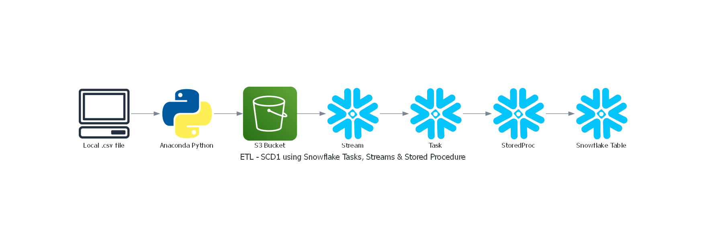

# 📊 ETL with Slowly Changing Dimension Type 1 (SCD1) using Snowflake Tasks, Streams & Stored Procedure

This project demonstrates an automated ETL pipeline that loads `.csv` files into Snowflake from an Amazon S3 bucket, and processes updates using **SCD Type 1** logic via **Snowflake Tasks, Streams, and Stored Procedures**.

---

## 🧩 Architecture Overview


1. **Anaconda Python Environment**  
   - Reads a `.csv` file from local storage  
   - Uploads it to S3 using `boto3`  
   - Uses a `.yml` config file to securely manage AWS Secrets via Anaconda

2. **Amazon S3**  
   - Serves as the landing zone for raw CSV files

3. **Snowflake Configuration**
   - **External Stage**: Points to the S3 bucket
   - **Stream**: Tracks new rows in a staging table
   - **Task**: Executes every minute to check for new files
   - **Stored Procedure**: Implements SCD Type 1 merge logic (insert or update)

---

## 🔧 Tech Stack

- **Python (Anaconda)** – For uploading files and managing AWS credentials
- **Amazon S3** – Storage layer for raw data
- **Snowflake**  
  - **Stages** – Reference S3 objects  
  - **Streams** – Change data capture  
  - **Tasks** – Scheduled execution  
  - **Stored Procedures** – SCD1 logic in SQL/JavaScript

---

## 📂 Repository Structure

---

## ▶️ How It Works

1. 🐍 Run the Python script to upload `customer_full_data.csv` to S3:
   ```bash
   python UploadFileToS3.py

2. 🏗️ In Snowflake:
    - Create an external stage to the S3 bucket
    - Create a stream to track staging table changes
    - Create a task to run every minute
    - Task calls a Stored Procedure to perform SCD Type 1 updates

3. 🧠 The Stored Procedure logic:
    - Inserts new rows
    - Updates existing records based on a business key (e.g., customer_id)

---

## ✅ Highlights

- Real-world use of Snowflake Tasks, Streams, and Stored Procedures
- Secure AWS credential management using .yml
- SCD1 logic for maintaining clean and updated dimension tables

---

## 🏷️ Tags & Topics
```
Use these hashtags when sharing the project:
#DataEngineering #Snowflake #SCD1 #ETL #Python #AWS #S3 #StoredProcedure #Tasks #Streams #DataPipeline #Anaconda #CloudData

```
